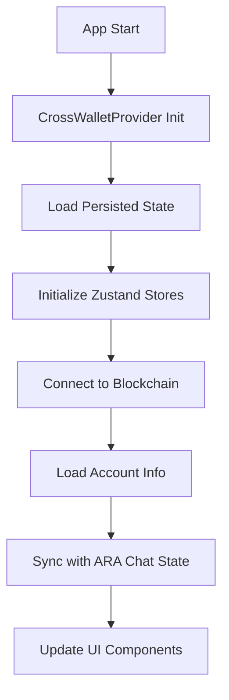
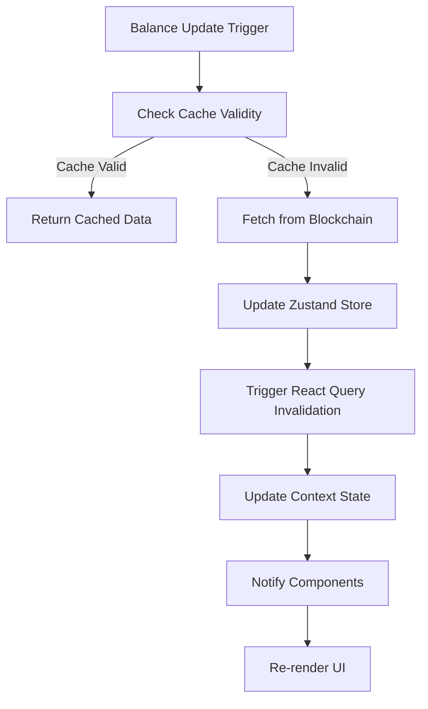
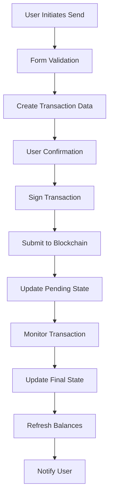

# Cross Wallet 통합 데이터 플로우 전략

## 📊 개요

Cross Wallet Desktop의 상태 관리 시스템을 ARA Chat에 통합하면서 기존 시스템과의 호환성을 유지하고, 효율적인 데이터 플로우를 구성하는 전략을 정의합니다.

## 🏗️ 상태 관리 아키텍처

### 1. 전체 상태 구조

```
ARA Chat State Layer
├── BlockchainStateProvider (기존)
│   ├── wallet connection state
│   ├── network information
│   └── transaction status
├── CrossWalletProvider (신규)
│   ├── Cross Wallet state bridge
│   ├── account management
│   └── token information
└── ChatStateProvider (기존 - 유지)
    ├── chat messages
    ├── conversation history
    └── UI state
```

### 2. Store 계층 구조

#### Level 1: Zustand Stores (Cross Wallet 기반)
```typescript
// Zustand 기반 스토어들
interface StoreLayer {
  configStore: ConfigStore;        // 계정, 설정 관리
  balanceStore: BalanceStore;      // 토큰 잔액 정보
  transferStore: TransferStore;    // 송금 상태 관리
  historyStore: HistoryStore;      // 거래 내역
}
```

#### Level 2: React Context (ARA Chat 통합)
```typescript
// ARA Chat 통합 Context
interface CrossWalletContext {
  // Cross Wallet 상태 프록시
  accounts: Account[];
  currentAccount: Account | null;
  tokens: TokenWithChainInfo[];

  // 통합 상태
  isConnected: boolean;
  syncStatus: 'synced' | 'syncing' | 'error';

  // 액션 프록시
  connectWallet: () => Promise<void>;
  disconnectWallet: () => void;
  sendToken: (params: SendParams) => Promise<void>;
}
```

#### Level 3: Component State (로컬 UI 상태)
```typescript
// 컴포넌트별 로컬 상태
interface ComponentState {
  // UI 전용 상태
  isModalOpen: boolean;
  selectedToken: TokenData | null;
  formData: SendFormData;

  // 임시 상태
  pendingTransactions: Transaction[];
  validationErrors: ValidationError[];
}
```

## 🔄 데이터 플로우 패턴

### 1. 초기화 플로우



**구현 코드**:
```typescript
// app/src/providers/CrossWalletProvider.tsx
export function CrossWalletProvider({ children }: Props) {
  const [isInitialized, setIsInitialized] = useState(false);

  useEffect(() => {
    const initializeCrossWallet = async () => {
      // 1. 지속된 상태 복원
      await restorePersistedState();

      // 2. 블록체인 연결 확인
      await checkBlockchainConnection();

      // 3. 계정 정보 로드
      await loadAccountInformation();

      // 4. ARA Chat 상태와 동기화
      await syncWithAraChatState();

      setIsInitialized(true);
    };

    initializeCrossWallet();
  }, []);

  if (!isInitialized) {
    return <LoadingSpinner />;
  }

  return (
    <CrossWalletContext.Provider value={contextValue}>
      {children}
    </CrossWalletContext.Provider>
  );
}
```

### 2. 토큰 잔액 업데이트 플로우



**구현 코드**:
```typescript
// app/src/hooks/useCrossWalletBalance.ts
export function useCrossWalletBalance() {
  const { currentAccount } = useCrossWalletStore();

  const { data: tokens, isLoading, error } = useQuery({
    queryKey: ['tokens', currentAccount?.address],
    queryFn: async () => {
      if (!currentAccount?.address) return [];

      // Cross Wallet의 balance 로직 활용
      const balanceData = await fetchTokenBalances(currentAccount.address);

      // Zustand 스토어 업데이트
      balanceStore.getState().updateTokens(balanceData);

      return balanceData;
    },
    staleTime: 5 * 60 * 1000, // 5분 캐시
    cacheTime: 10 * 60 * 1000, // 10분 보관
    refetchInterval: 30 * 1000, // 30초마다 백그라운드 업데이트
  });

  return { tokens, isLoading, error };
}
```

### 3. 송금 트랜잭션 플로우



**구현 코드**:
```typescript
// app/src/hooks/useCrossWalletTransfer.ts
export function useCrossWalletTransfer() {
  const { currentAccount } = useCrossWalletStore();
  const { mutateAsync: refreshBalance } = useQueryClient();

  const sendTokenMutation = useMutation({
    mutationFn: async (params: SendTokenParams) => {
      // 1. 트랜잭션 데이터 생성
      const txData = await createTransactionData(params);

      // 2. 사용자 확인 및 서명
      const signedTx = await signTransaction(txData);

      // 3. 블록체인에 전송
      const txHash = await submitTransaction(signedTx);

      // 4. 진행 상태 업데이트
      transferStore.getState().addPendingTransaction({
        hash: txHash,
        status: 'pending',
        ...params
      });

      return txHash;
    },
    onSuccess: async (txHash) => {
      // 트랜잭션 모니터링 시작
      monitorTransaction(txHash);

      // 잔액 새로고침 (낙관적 업데이트)
      await refreshBalance(['tokens', currentAccount?.address]);
    },
    onError: (error) => {
      // 에러 처리 및 사용자 알림
      handleTransactionError(error);
    }
  });

  return { sendToken: sendTokenMutation.mutateAsync };
}
```

## 🔧 상태 동기화 전략

### 1. Cross Wallet ↔ ARA Chat 상태 동기화

#### 실시간 동기화
```typescript
// app/src/hooks/useStateSynchronization.ts
export function useStateSynchronization() {
  const crossWalletState = useCrossWalletStore();
  const { wallet, setWallet } = useBlockchainWallet();

  // Cross Wallet → ARA Chat 동기화
  useEffect(() => {
    if (crossWalletState.currentAccount && !wallet.isConnected) {
      setWallet({
        isConnected: true,
        address: crossWalletState.currentAccount.address,
        // ... 기타 필요한 정보
      });
    }
  }, [crossWalletState.currentAccount, wallet.isConnected]);

  // ARA Chat → Cross Wallet 동기화
  useEffect(() => {
    if (wallet.isConnected && !crossWalletState.currentAccount) {
      // ARA Chat에서 지갑 연결된 경우 Cross Wallet에도 반영
      crossWalletState.setCurrentAccount({
        address: wallet.address,
        // ... 기타 정보 매핑
      });
    }
  }, [wallet.isConnected, crossWalletState.currentAccount]);
}
```

#### 충돌 해결 전략
```typescript
interface SyncConflictResolver {
  resolveAccountConflict: (
    crossWalletAccount: Account,
    araChatWallet: WalletState
  ) => Account;

  resolveBalanceConflict: (
    crossWalletBalance: TokenBalance[],
    araChatBalance: TokenBalance[]
  ) => TokenBalance[];

  resolveConnectionConflict: (
    crossWalletConnected: boolean,
    araChatConnected: boolean
  ) => boolean;
}

const conflictResolver: SyncConflictResolver = {
  resolveAccountConflict: (cwAccount, acWallet) => {
    // Cross Wallet 정보를 우선으로 하되,
    // 최신 활동이 있는 계정을 선택
    const cwLastActivity = cwAccount.lastActivity || 0;
    const acLastActivity = acWallet.lastActivity || 0;

    return cwLastActivity > acLastActivity ? cwAccount :
      mapAraChatWalletToAccount(acWallet);
  }
};
```

### 2. 캐싱 전략

#### 계층적 캐싱
```typescript
// 캐시 계층 구조
interface CacheStrategy {
  L1: 'Memory Cache';      // React Query (5분)
  L2: 'Local Storage';     // Zustand Persist (24시간)
  L3: 'IndexedDB';         // 대용량 데이터 (7일)
  L4: 'Blockchain RPC';    // 실시간 데이터
}
```

#### 캐시 무효화 전략
```typescript
// app/src/utils/cacheInvalidation.ts
export class CacheInvalidationManager {
  private queryClient: QueryClient;

  // 트랜잭션 완료 시 관련 캐시 무효화
  invalidateAfterTransaction(txHash: string, affectedAddresses: string[]) {
    affectedAddresses.forEach(address => {
      // 잔액 캐시 무효화
      this.queryClient.invalidateQueries(['tokens', address]);
      this.queryClient.invalidateQueries(['balance', address]);

      // 거래 내역 캐시 무효화
      this.queryClient.invalidateQueries(['transactions', address]);
    });
  }

  // 네트워크 변경 시 모든 캐시 무효화
  invalidateOnNetworkChange(newChainId: number) {
    this.queryClient.invalidateQueries({
      predicate: (query) => {
        return query.queryKey.includes('tokens') ||
               query.queryKey.includes('balance') ||
               query.queryKey.includes('transactions');
      }
    });
  }
}
```

## 📡 API 통합 전략

### 1. 데이터 소스 통합

#### Multi-Provider Pattern
```typescript
// app/src/services/DataProviderManager.ts
export class DataProviderManager {
  private providers: Map<string, DataProvider> = new Map();

  constructor() {
    // Cross Wallet 기본 프로바이더
    this.providers.set('crosswallet', new CrossWalletDataProvider());

    // ARA Chat 기존 프로바이더
    this.providers.set('arachat', new AraChatDataProvider());

    // 외부 API 프로바이더들
    this.providers.set('coingecko', new CoinGeckoProvider());
    this.providers.set('etherscan', new EtherscanProvider());
  }

  async getTokenBalance(address: string, tokenAddress: string): Promise<string> {
    // 우선순위에 따라 데이터 소스 선택
    const providers = ['crosswallet', 'arachat', 'etherscan'];

    for (const providerName of providers) {
      try {
        const provider = this.providers.get(providerName);
        const balance = await provider?.getTokenBalance(address, tokenAddress);
        if (balance !== null) return balance;
      } catch (error) {
        console.warn(`Provider ${providerName} failed:`, error);
        // 다음 프로바이더로 fallback
      }
    }

    throw new Error('All providers failed to get token balance');
  }
}
```

### 2. 에러 처리 및 재시도

#### Resilient Data Fetching
```typescript
// app/src/utils/resilientFetching.ts
export function createResilientQuery<T>(
  queryFn: () => Promise<T>,
  options: ResilientOptions = {}
) {
  const {
    maxRetries = 3,
    backoffMultiplier = 2,
    fallbackFn,
  } = options;

  return useQuery({
    queryFn: async () => {
      let lastError: Error;

      for (let attempt = 0; attempt <= maxRetries; attempt++) {
        try {
          return await queryFn();
        } catch (error) {
          lastError = error as Error;

          if (attempt < maxRetries) {
            const delay = Math.pow(backoffMultiplier, attempt) * 1000;
            await new Promise(resolve => setTimeout(resolve, delay));
          }
        }
      }

      // 모든 재시도 실패 시 fallback 시도
      if (fallbackFn) {
        try {
          return await fallbackFn();
        } catch (fallbackError) {
          console.error('Fallback also failed:', fallbackError);
        }
      }

      throw lastError!;
    },
    retry: false, // 수동으로 재시도 관리
  });
}
```

## 🔄 실시간 업데이트 전략

### 1. WebSocket 연결 관리

```typescript
// app/src/services/RealtimeUpdateManager.ts
export class RealtimeUpdateManager {
  private wsConnections: Map<string, WebSocket> = new Map();
  private subscriptions: Map<string, Set<string>> = new Map();

  subscribeToAddressUpdates(address: string, callback: (data: any) => void) {
    // 주소별 실시간 업데이트 구독
    const wsKey = `balance_${address}`;

    if (!this.wsConnections.has(wsKey)) {
      const ws = new WebSocket(`wss://api.cross.network/v1/subscribe/${address}`);
      this.wsConnections.set(wsKey, ws);

      ws.onmessage = (event) => {
        const data = JSON.parse(event.data);
        callback(data);
      };
    }
  }

  subscribeToTransactionUpdates(txHash: string, callback: (status: TxStatus) => void) {
    // 트랜잭션 상태 실시간 추적
    const wsKey = `tx_${txHash}`;

    const ws = new WebSocket(`wss://api.cross.network/v1/tx/${txHash}`);
    ws.onmessage = (event) => {
      const status = JSON.parse(event.data);
      callback(status);

      if (status.confirmed || status.failed) {
        ws.close();
        this.wsConnections.delete(wsKey);
      }
    };

    this.wsConnections.set(wsKey, ws);
  }
}
```

### 2. 폴링 백업 전략

```typescript
// WebSocket 실패 시 폴링으로 fallback
export function useRealtimeBalance(address: string) {
  const [usePolling, setUsePolling] = useState(false);

  // WebSocket 구독
  useEffect(() => {
    if (!usePolling) {
      try {
        realtimeManager.subscribeToAddressUpdates(address, (data) => {
          updateBalance(data);
        });
      } catch (error) {
        console.warn('WebSocket failed, falling back to polling');
        setUsePolling(true);
      }
    }
  }, [address, usePolling]);

  // 폴링 백업
  useQuery({
    queryKey: ['balance', address],
    queryFn: () => fetchBalance(address),
    enabled: usePolling,
    refetchInterval: 10000, // 10초마다 폴링
  });
}
```

## 📊 성능 최적화

### 1. 배치 요청 최적화

```typescript
// app/src/utils/batchRequestManager.ts
export class BatchRequestManager {
  private pendingRequests: Map<string, Promise<any>> = new Map();
  private batchTimeout: NodeJS.Timeout | null = null;

  async getTokenPrices(symbols: string[]): Promise<Map<string, number>> {
    // 중복 요청 방지
    const cacheKey = symbols.sort().join(',');

    if (this.pendingRequests.has(cacheKey)) {
      return this.pendingRequests.get(cacheKey);
    }

    // 배치 요청 생성
    const batchRequest = this.createBatchPriceRequest(symbols);
    this.pendingRequests.set(cacheKey, batchRequest);

    // 요청 완료 후 캐시 정리
    batchRequest.finally(() => {
      this.pendingRequests.delete(cacheKey);
    });

    return batchRequest;
  }

  private createBatchPriceRequest(symbols: string[]): Promise<Map<string, number>> {
    return new Promise((resolve, reject) => {
      // 100ms 내 추가 요청 대기
      if (this.batchTimeout) {
        clearTimeout(this.batchTimeout);
      }

      this.batchTimeout = setTimeout(async () => {
        try {
          const prices = await this.fetchBatchPrices(symbols);
          resolve(prices);
        } catch (error) {
          reject(error);
        }
      }, 100);
    });
  }
}
```

### 2. 메모리 사용량 최적화

```typescript
// app/src/hooks/useOptimizedTokenList.ts
export function useOptimizedTokenList(tokens: TokenWithChainInfo[]) {
  // 가상화 스크롤을 위한 아이템 높이 계산
  const itemHeight = 64; // px
  const containerHeight = 400; // px
  const visibleItemCount = Math.ceil(containerHeight / itemHeight);

  // 현재 뷰포트에 보이는 토큰만 렌더링
  const [startIndex, setStartIndex] = useState(0);
  const [endIndex, setEndIndex] = useState(visibleItemCount);

  const visibleTokens = useMemo(() => {
    return tokens.slice(startIndex, endIndex + 1);
  }, [tokens, startIndex, endIndex]);

  // 스크롤 이벤트 핸들러
  const handleScroll = useCallback((scrollTop: number) => {
    const newStartIndex = Math.floor(scrollTop / itemHeight);
    const newEndIndex = Math.min(newStartIndex + visibleItemCount, tokens.length - 1);

    setStartIndex(newStartIndex);
    setEndIndex(newEndIndex);
  }, [tokens.length, itemHeight, visibleItemCount]);

  return {
    visibleTokens,
    totalHeight: tokens.length * itemHeight,
    handleScroll,
  };
}
```

## 🎯 데이터 일관성 보장

### 1. Optimistic Updates

```typescript
// app/src/hooks/useOptimisticTransfer.ts
export function useOptimisticTransfer() {
  const queryClient = useQueryClient();

  const optimisticSend = useMutation({
    mutationFn: sendTokenTransaction,

    onMutate: async (variables) => {
      // 현재 잔액 캐시 백업
      const previousBalance = queryClient.getQueryData(['tokens', variables.fromAddress]);

      // 낙관적 업데이트 적용
      queryClient.setQueryData(['tokens', variables.fromAddress], (old: TokenData[]) => {
        return old?.map(token => {
          if (token.address === variables.tokenAddress) {
            return {
              ...token,
              balance: (BigInt(token.balance) - BigInt(variables.amount)).toString()
            };
          }
          return token;
        });
      });

      return { previousBalance };
    },

    onError: (err, variables, context) => {
      // 에러 시 이전 상태로 롤백
      if (context?.previousBalance) {
        queryClient.setQueryData(['tokens', variables.fromAddress], context.previousBalance);
      }
    },

    onSettled: (data, error, variables) => {
      // 트랜잭션 완료 후 실제 데이터로 새로고침
      queryClient.invalidateQueries(['tokens', variables.fromAddress]);
    }
  });

  return optimisticSend;
}
```

### 2. 상태 검증

```typescript
// app/src/utils/stateValidator.ts
export class StateValidator {
  validateTokenBalance(token: TokenData): boolean {
    // 잔액 유효성 검사
    try {
      const balance = BigInt(token.balance);
      return balance >= 0n;
    } catch {
      return false;
    }
  }

  validateAccountConsistency(crossWalletAccount: Account, araChatWallet: WalletState): boolean {
    // 계정 일관성 검사
    if (crossWalletAccount.address !== araChatWallet.address) {
      console.warn('Account address mismatch detected');
      return false;
    }

    return true;
  }

  validateTransactionState(tx: Transaction): boolean {
    // 트랜잭션 상태 유효성 검사
    const validStatuses = ['pending', 'confirmed', 'failed'];
    return validStatuses.includes(tx.status);
  }
}
```

이 데이터 플로우 전략을 통해 Cross Wallet과 ARA Chat의 상태를 안전하고 효율적으로 통합하면서, 실시간 업데이트와 성능 최적화를 동시에 달성할 수 있습니다.