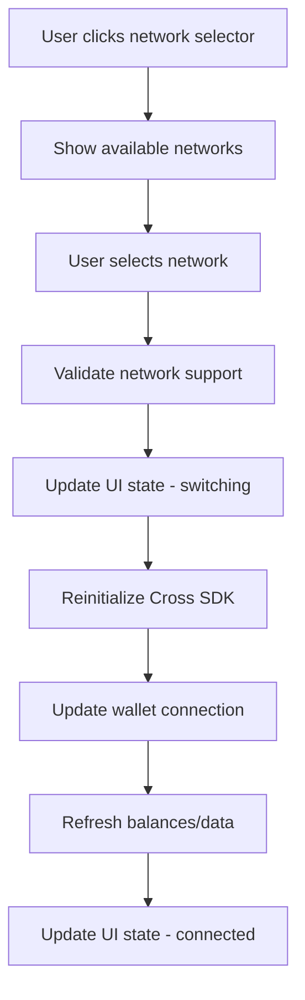
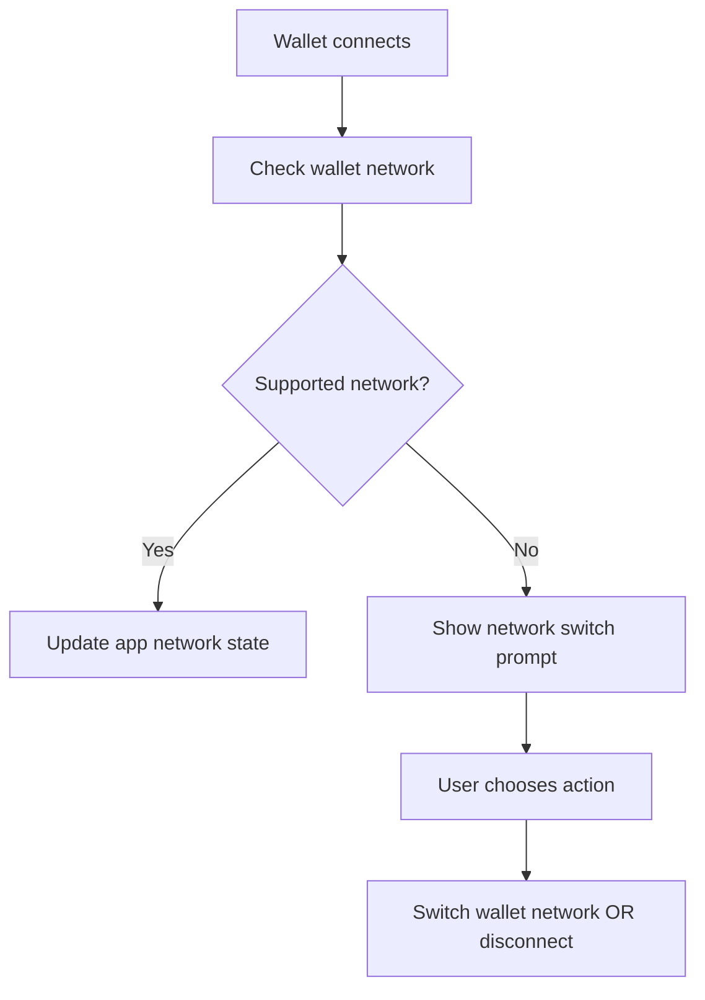

# Cross SDK Network Separation Design

## 🎯 Design Overview

현재 Cross SDK가 하드코딩된 mainnet을 사용하고 있는 문제를 해결하여, 사용자가 mainnet과 testnet을 명확히 구분하고 전환할 수 있는 시스템을 설계합니다.

## 📊 Current State Analysis

### 🔍 Existing Configuration Issues
```typescript
// 현재 문제 (CrossSDKProvider.tsx:73)
const network = envMode === 'production' ? crossMainnet : crossMainnet  // Always mainnet!

// Chain ID 하드코딩 문제들
chainId: 4157 // Cross mainnet only - multiple locations
```

### 📂 현재 SDK 사용 패턴 (from cross-sdk-js-sample)
```typescript
import { crossMainnet, crossTestnet, bscMainnet, bscTestnet } from '@to-nexus/sdk'

const availableNetworks = [
  { id: 'cross-mainnet', name: 'Cross Mainnet', network: crossMainnet },
  { id: 'cross-testnet', name: 'Cross Testnet', network: crossTestnet },
  // ... other networks
]
```

## 🏗️ Architecture Design

### 🎪 Network Configuration System

```typescript
// /src/config/networks.ts
export interface NetworkConfig {
  id: string
  name: string
  displayName: string
  chainId: number
  rpcUrl: string
  blockExplorer: string
  nativeCurrency: {
    name: string
    symbol: string
    decimals: number
  }
  testnet: boolean
  crossSdkNetwork: any // crossMainnet | crossTestnet
}

export const NETWORK_CONFIGS: Record<string, NetworkConfig> = {
  'cross-mainnet': {
    id: 'cross-mainnet',
    name: 'cross-mainnet',
    displayName: 'Cross Mainnet',
    chainId: 4157,
    rpcUrl: 'https://rpc.crosstoken.io',
    blockExplorer: 'https://crossscan.io',
    nativeCurrency: {
      name: 'Cross',
      symbol: 'CROSS',
      decimals: 18
    },
    testnet: false,
    crossSdkNetwork: crossMainnet
  },
  'cross-testnet': {
    id: 'cross-testnet',
    name: 'cross-testnet',
    displayName: 'Cross Testnet',
    chainId: 4158, // Assuming testnet chain ID
    rpcUrl: 'https://rpc-testnet.crosstoken.io',
    blockExplorer: 'https://testnet.crossscan.io',
    nativeCurrency: {
      name: 'Cross Test',
      symbol: 'tCROSS',
      decimals: 18
    },
    testnet: true,
    crossSdkNetwork: crossTestnet
  }
}

export const DEFAULT_NETWORK = 'cross-mainnet'
export const SUPPORTED_NETWORKS = Object.keys(NETWORK_CONFIGS)
```

### 🔄 Network State Management

```typescript
// /src/stores/networkStore.ts
interface NetworkState {
  currentNetwork: string
  isConnected: boolean
  switchingNetwork: boolean
  availableNetworks: string[]
  networkError?: string
}

interface NetworkActions {
  switchNetwork: (networkId: string) => Promise<void>
  initializeNetwork: (networkId?: string) => Promise<void>
  refreshNetworkState: () => Promise<void>
  resetNetworkError: () => void
}
```

### 🎛️ Enhanced Cross SDK Provider

```typescript
// /src/providers/NetworkAwareCrossSDKProvider.tsx
interface NetworkAwareCrossSDKProviderProps {
  children: ReactNode
  defaultNetwork?: string
  allowNetworkSwitching?: boolean
}

export function NetworkAwareCrossSDKProvider({
  children,
  defaultNetwork = DEFAULT_NETWORK,
  allowNetworkSwitching = true
}: NetworkAwareCrossSDKProviderProps) {
  // Network-aware initialization
  // SDK instance management per network
  // Network switching capabilities
}
```

## 🔧 Component Architecture

### 🌐 Network Selector Component

```typescript
// /src/components/network/NetworkSelector.tsx
interface NetworkSelectorProps {
  currentNetwork: string
  onNetworkChange: (networkId: string) => void
  disabled?: boolean
  showTestnets?: boolean
  className?: string
}

export function NetworkSelector({
  currentNetwork,
  onNetworkChange,
  disabled = false,
  showTestnets = true,
  className
}: NetworkSelectorProps) {
  // Network dropdown with icons
  // Testnet warning indicators
  // Network status indicators
}
```

### 📊 Network Status Indicator

```typescript
// /src/components/network/NetworkStatusIndicator.tsx
interface NetworkStatusProps {
  network: string
  className?: string
  showDetails?: boolean
}

export function NetworkStatusIndicator({
  network,
  className,
  showDetails = false
}: NetworkStatusProps) {
  // Network name and icon
  // Connection status
  // Testnet badge if applicable
}
```

### ⚠️ Network Warning Banner

```typescript
// /src/components/network/NetworkWarningBanner.tsx
export function NetworkWarningBanner() {
  // Show when on testnet
  // Warning about test tokens
  // Switch to mainnet button
}
```

## 🔄 Network Switching Flow

### 1️⃣ User-Initiated Network Switch


### 2️⃣ Automatic Network Detection


## 💾 State Persistence

### 🔄 Network Preference Storage
```typescript
// /src/hooks/useNetworkPreference.ts
export function useNetworkPreference() {
  // Store user's preferred network
  // Restore on app load
  // Clear on logout
  return {
    preferredNetwork: string,
    setPreferredNetwork: (network: string) => void,
    clearPreference: () => void
  }
}
```

## 🎨 UI/UX Design Specifications

### 🎯 Network Selector Design
```typescript
// Location: ChatHeader, WalletDashboard, TokenCreation
<NetworkSelector
  currentNetwork={currentNetwork}
  onNetworkChange={handleNetworkChange}
  className="ml-auto"
  showTestnets={true}
/>

// Visual Design:
// - Dropdown with network icons
// - Current network highlighted
// - Testnet networks with warning badge
// - Connection status indicator
```

### ⚠️ Testnet Warning Design
```typescript
// Show when currentNetwork.testnet === true
<NetworkWarningBanner>
  ⚠️ You are connected to Cross Testnet
  Tokens on this network have no real value
  [Switch to Mainnet]
</NetworkWarningBanner>
```

### 🔄 Network Switch Animation
```typescript
// Loading state during network switching
<div className="flex items-center gap-2">
  <Spinner className="h-4 w-4" />
  <span>Switching to {targetNetwork}...</span>
</div>
```

## 🔗 Integration Points

### 🎪 Token Creation Integration
```typescript
// /src/components/chat/token/TokenCreationForm.tsx
// Network-aware token creation
const { currentNetwork } = useNetwork()
const networkConfig = NETWORK_CONFIGS[currentNetwork]

// Show network in UI
<div className="network-info">
  <label>Deployment Network</label>
  <NetworkStatusIndicator network={currentNetwork} showDetails />
</div>

// Update deployment parameters
const deploymentParams = {
  ...params,
  network: currentNetwork,
  chainId: networkConfig.chainId,
  rpcUrl: networkConfig.rpcUrl
}
```

### 🎨 Wallet Dashboard Integration
```typescript
// /src/components/wallet/WalletDashboard.tsx
// Network-aware balance display
const { currentNetwork } = useNetwork()
const isTestnet = NETWORK_CONFIGS[currentNetwork].testnet

return (
  <div>
    {isTestnet && <NetworkWarningBanner />}
    <NetworkSelector
      currentNetwork={currentNetwork}
      onNetworkChange={switchNetwork}
    />
    <TokenBalance network={currentNetwork} />
  </div>
)
```

## 🔒 Security Considerations

### 🛡️ Network Validation
```typescript
// Validate network support before operations
export function validateNetworkOperation(
  operation: 'token-creation' | 'wallet-connect' | 'transaction',
  networkId: string
): boolean {
  const config = NETWORK_CONFIGS[networkId]
  if (!config) return false

  // Additional validation per operation type
  switch (operation) {
    case 'token-creation':
      return config.crossSdkNetwork !== undefined
    case 'wallet-connect':
      return SUPPORTED_NETWORKS.includes(networkId)
    default:
      return true
  }
}
```

### ⚠️ Testnet Safety
```typescript
// Clear warnings about testnet usage
export function getNetworkWarnings(networkId: string): string[] {
  const config = NETWORK_CONFIGS[networkId]
  const warnings: string[] = []

  if (config.testnet) {
    warnings.push('이 네트워크의 토큰은 실제 가치가 없습니다')
    warnings.push('테스트 목적으로만 사용하세요')
    warnings.push('실제 거래는 메인넷을 사용하세요')
  }

  return warnings
}
```

## 📱 Mobile Responsiveness

### 📱 Network Selector Mobile Design
```typescript
// Responsive network selector
<div className="network-selector">
  {/* Desktop: Dropdown */}
  <div className="hidden md:block">
    <NetworkDropdown />
  </div>

  {/* Mobile: Bottom sheet */}
  <div className="md:hidden">
    <NetworkBottomSheet />
  </div>
</div>
```

## 🧪 Testing Strategy

### ✅ Network Switch Testing
```typescript
// Test cases for network switching
describe('Network Switching', () => {
  test('switches from mainnet to testnet successfully')
  test('preserves wallet connection during switch')
  test('updates all UI components after switch')
  test('shows appropriate warnings for testnet')
  test('handles network switch failures gracefully')
})
```

## 📈 Implementation Priority

### 🎯 Phase 1: Core Infrastructure
1. ✅ Network configuration system
2. ✅ Enhanced Cross SDK Provider
3. ✅ Basic network switching logic
4. ✅ State management setup

### 🎯 Phase 2: UI Components
1. ✅ Network selector component
2. ✅ Network status indicator
3. ✅ Network warning banner
4. ✅ Mobile responsive design

### 🎯 Phase 3: Feature Integration
1. ✅ Token creation network awareness
2. ✅ Wallet dashboard integration
3. ✅ Transaction history per network
4. ✅ Cross-network data isolation

### 🎯 Phase 4: Polish & Testing
1. ✅ Error handling & recovery
2. ✅ Loading states & animations
3. ✅ Comprehensive testing
4. ✅ Performance optimization

## 🔄 Migration Strategy

### 📊 Current State → Target State
```typescript
// Before: Hard-coded mainnet
const network = crossMainnet

// After: Dynamic network selection
const network = NETWORK_CONFIGS[currentNetwork].crossSdkNetwork
```

### 🛠️ Breaking Changes
- Environment variable changes for network selection
- SDK initialization parameters update
- Component prop changes for network awareness

### 🔄 Backwards Compatibility
- Default to mainnet if no network specified
- Graceful fallback for unsupported networks
- Migration guide for existing integrations

---

## ✅ Success Metrics

1. **User Experience**: Seamless network switching under 3 seconds
2. **Data Integrity**: Complete separation of mainnet/testnet data
3. **Security**: Clear testnet warnings prevent user confusion
4. **Reliability**: 99.9% successful network switches
5. **Performance**: No degradation in app loading time

This design ensures a robust, user-friendly network management system that clearly separates mainnet and testnet operations while maintaining the security and performance standards of the ARA Chat application.